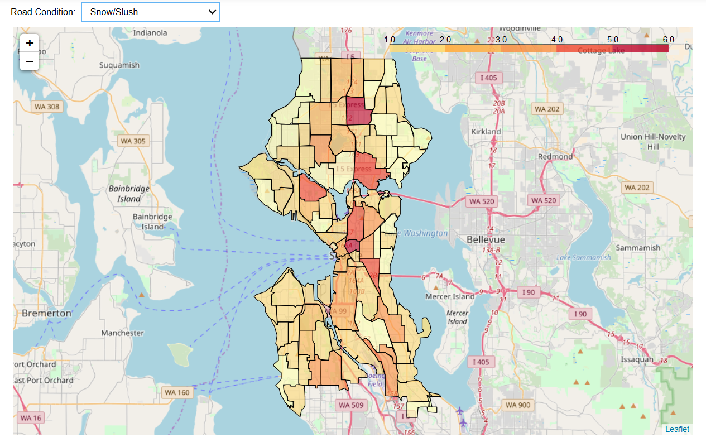
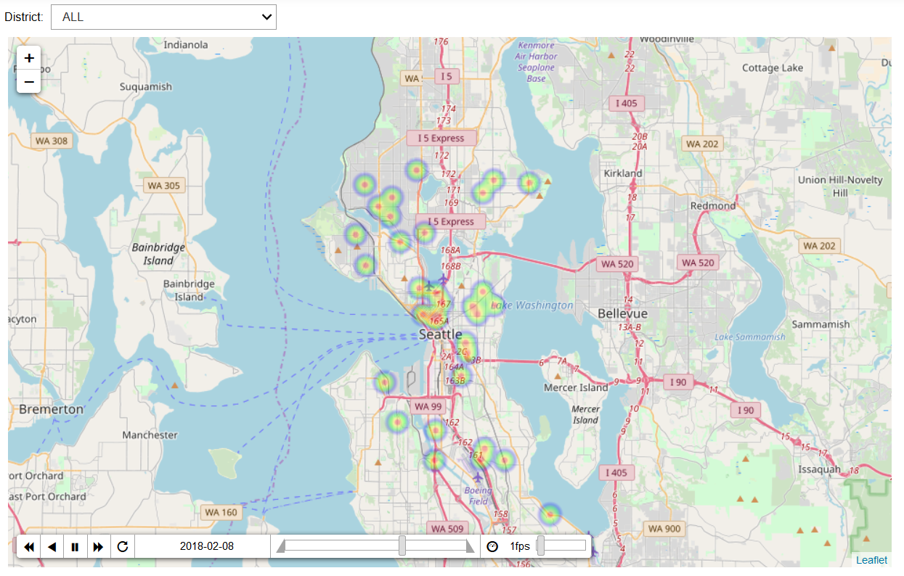
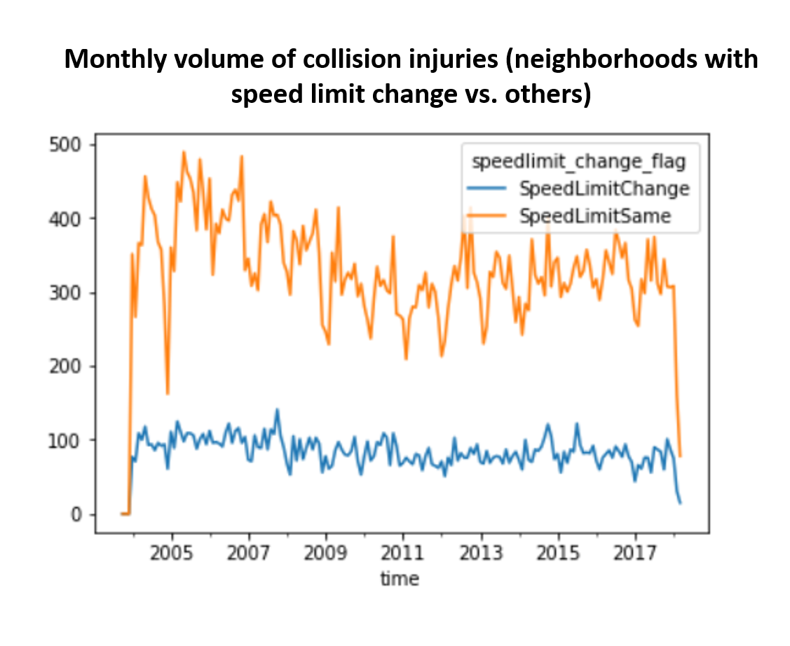

## washington collisions

Washington Collisions is a tool for cleaning up, visualizating and 
analyzing Seattle collisions and neighborhoods data as well as weather data.
In our example files we show visualizations using the Folium python 
package, which show how collisions vary by neighborhood under various weather
and road surface conditions. We also investigate the question of whether or
not speed limits changing in central Seattle in October 2016 had a significant 
impact on the number of collisions, the number of speeding related collisions
or collision related injuries.

### Organization of the  project

The project has the following structure:

    wa_collisions/
      |- README.md
      |- wa_collisions/
         |- __init__.py
         |- neighborhood_reader.py
         |- read_clean_integrate_data.py
         |- render_stats.py
         |- visualizer.py
         |- data/
            |- Collisions_test.csv
            |- Collisions_With_Neighborhoods_test.csv
            |- Weather_test.csv
            |- Neighborhoods
                |- Neighborhoods.json
                |- WGS84
                    |- ...
         |- tests/
            |- __init__.py
            |- test_neighborhood_reader.py
            |- test_read_clean_integrate.py
            |- test_render_stats.py
            |- test_visualizer.py
      |- examples/ 
         |- Example - CausalImpact SpeedLimits.ipynb
         |- Example - Prepare Data.ipynb 
         |- Example - Visualize Data.ipynb 
      |- doc/
         |- Feature_Design_V1.md
         |- Feature_Design_V2.md
         |- Technology_Review_Presentation.pptx
         |- datasets_V1.md
         |- technology_review_outline.md
         |- wa_collisions_final_presentation.pptx
         |- _static/
            |- ...
         |- _images/
            |- ...  
      |- .coverage
      |- .coveragerc
      |- .gitignore
      |- .pylintrc
      |- .travis.yml
      |- LICENSE
      |- requirements.txt
      |- setup.py
      

### Installation

To install the package run the following:
    python setup.py install
Then install the required dependancies:
    pip install -r requirements.txt
Install the [Causal Impact](https://github.com/jamalsenouci/causalimpact) package which is not available on pip. 
    pip install git+http://github.com/jamalsenouci/causalimpact.git

There are additional installation and testing instructions provided in [doc folder](doc/test_package_installation_instructions.md). 

NEED TO FIGURE OUT HOW TO DO! 

For installation and distribution we will use the python standard
library `distutils` module. This module uses a `setup.py` file to
figure out how to install your software on a particular system. For a
small project such as this one, managing installation of the software
modules and the data is rather simple.

A `vehicle_collisions/version.py` contains all of the information needed for the
installation and for setting up the [PyPI
page](https://pypi.python.org/pypi/vehicle_collisions) for the software. This
also makes it possible to install your software with using `pip` and
`easy_install`, which are package managers for Python software. The
`setup.py` file reads this information from there and passes it to the
`setup` function which takes care of the rest.

Much more information on packaging Python software can be found in the
[Hitchhiker's guide to
packaging](https://the-hitchhikers-guide-to-packaging.readthedocs.org).

### Examples

#### Prepare Data

The collisions and neighborhood data were sourced from the [Seattle Open Data](https://data.seattle.gov/).
The weather data is from the [Iowa State University database of hourly aiport 
AWOS/ASOS reports](https://mesonet.agron.iastate.edu/request/download.phtml). Download
instructions are available in [Example - Prepare Data](examples/Example%20-%20Prepare%20Data.ipynb).  The 
read_clean_integrate_data module works to prepare the data. The testing scripts 
use example data provided in wa_collisions/data. Users can use the read_clean_integrate_data
module to process data from their own city. Although please note, this functionality 
has not been tested.  

#### Visualize Data 

Since this is an interactive notebook, jupyter needs to be run with an additional parameter:

`jupyter notebook --NotebookApp.iopub_data_rate_limit=10000000000`

Additionally, the interactive map visuals will only work in Mozilla Firefox. 

Visualize the incidence of collisions around Seattle by neighborhood. The collisions can be
visualized by categorical variables (road condition) or indicator variables (pedestrian 
involved, cyclist involved, fatality, etc.). Additionally, road conditions can be compared with 
weather data to answer questions like: "what is the incidence of ice related collisions
when the weather is overcast?" 

The number of collisions across Seattle can also be visualized over time. This allows the user 
to understand how the collisions changed across neighborhoods of Seattle. 

#### Causal Impact Analysis 

We investigated whethere there was an effect of changing speed limits on collision rate. 
The example notebook groups neighborhoods into those where speed limits changed in 2016 
and those where they did not. We used [Causal Impact](https://github.com/jamalsenouci/causalimpact) package and Bayesian structural time 
series models to compare collisions and injuries “control” and “treatment.”

### Project History

This project was developed during DATA 515 Software Design at the Unviersity of
Washington. In addition to the project goals outlined below, the project aims to create 
a cohesive python module. During and after project development we welcome any 
feedback through the issues functionality on github. 

#### Project Goals:

1. Clean and prepare Seattle area collision data for regression and other machine learning projects.
3. Create a visualization of Seattle area collision data.
4. Advanced analysis of Seattle area collision data and the change in speed limits.

### Limitations

- The project can be installed through the setup.py, but it is not available for download pip. 
- The functionality has been tested extensively on Seattle data, but it has not been tested for any other cities. 

### Licensing and Acknowledgements

Washington Collisions uses only open source software and is available
for use and distribution under an MIT license.

Special thanks to Joe Hellerstein, Dave Beck and Dimitrios Gklezakos of
the University of Washington for instructing us on effective software 
engineering for data science and research projects.

Also, thanks to the shablona team for providing us with a great template from 
which we built this repo. 